# 过程事件日志 + 重放重建（规范化设计文档）

> **文档状态**：✅ 正式设计方案（SSOT）
> **版本**：v1.8
> **创建日期**：2026-08-28
> **状态**：SSOT 纯度复审修订（v1.5）→ TTFT 骨架即时反馈（v1.6，已实施）→ 时态换位哲学沉淀（v1.7，2026-09-08）→ step 分型 + 钉子心智模型沉淀（v1.8，2026-09-09）

### 变更记录

| 版本   | 日期         | 变更                                                                                                                                                                                                                                                                               |
| ---- | ---------- | -------------------------------------------------------------------------------------------------------------------------------------------------------------------------------------------------------------------------------------------------------------------------------- |
| v1.8 | 2026-09-09 | **「单轨 step 闭环 + 钉子」心智模型 + step 分型定案 + 剪枝执行**：新增 §3.8.6——① 心智模型：turn 本体是单轨 step 闭环连续运行时，交互输入（ask 回答/用户补充）是切断 step 连续性的「钉子」；ask 为**内生钉子**（LLM 判断需要的补充，属于单轨的自我暂停），用户补充为**外生钉子**（不请自来，类似伪新 turn 但保 turn 连续性）② step 分型：除纯文本 step 平铺外，非文本 step（工具调用/ask/补充/未答）**统一折叠块**，视觉 = 文本与非文本折叠块平铺 ③ 末尾必修：最后一个 step 必然是纯文本总结报告，结束后 UI 收敛除总结外全部过程、总结平铺在外 ④ **剪枝执行：supplement 合并机制已剪**（`_lastInterruptDivider` 锚 + 「补充 N 条」标签全删，每补充独立折叠块——钉子原子性落地，根除有状态锚类 + 缺口1 过度合并）；timeout 独立 kind 维持现状（用户定案：超时即结果，LLM 自决续跑已满足）。附形态总览图 `assets/session-render-timeline.svg` |
| v1.7 | 2026-09-08 | **时态换位展示哲学沉淀（对齐 Trae Work 设计第一性）**：顶层设计原则补「时态换位」——运行时过程一等公民（平铺直叙、交互输入自然嵌入任务时序，**触任务表例外：按 task 步级折叠收纳免长过程铺**），结束后结果一等公民（追加总结报告 step + 过程收敛进可折叠任务过程块），折叠=降级≠删除；新增 §3.8.5「用户交互输入的自然嵌入」定案（提问平铺 `.msg-qa--ask`、回答/补充折叠 `.msg-qa`、`host.after` 插当前 assistant 块之后即任务时序；任务表例外步级收纳放置） |
| v1.5 | 2026-08-28 | **SSOT 纯度复审（开发期，不做兼容包袱）**：① 每轮消息身份单源——新增「本轮身份」`currentRoundMeta`（由 meta 事件写入），消息标签一律读它，运行时与重放同一机制；废除「meta 更新全局 currentRoleName」与「顶栏=最后重放轮 meta」（伪真理源，与 `chat_role_pack` 冲突）② webview 渲染真相源收口为「当前轮 `processEvents[]`」，渲染类消息统一为 `process_event` 增量 + `replay_events` 整批，二者汇入同一数组、同一 `renderRoundBlock` ③ § 执行指标一律从 `ProcessEvent.metrics` 渲染；trace/securityAudit 划为调试面板（showMetrics）不参与 diff ④ 重放截断改按 round 粒度，杜绝半轮 ⑤ 删除兼容旧会话措辞（`processEvents` 可选仅因 pending 轮天然无事件） |
| v1.4 | 2026-08-28 | **存储形态合案（用户设计指针）**：过程事件从独立 JSONL **并入 Round 文件**（`Round.processEvents?: ProcessEvent[]` 可选字段）——删 round 即删事件、分叉即共享、截断即覆盖，生命周期天然原子，废除独立 EventLog 存储 + 宿主双路径 GC 联动（撤销 v1.3 B1 复杂度）；正文与过程同文件同轮，重放交织天然成立（撤销 v1.3 C1 的 host 编排负担）。事件条目类型统一命名 `ProcessEvent`。S1 从「新接口 IEventLogStore」降为「Round 类型 + 事件类型定义」 |
| v1.3 | 2026-08-28 | **评审修订收口（159 审查）**：① 写入路径改「流式期间内存缓冲 → 流结束一次性以 latestRoundId 落盘」（宿主流式期间无 roundId 可写，A1）；② 事件模型补 `memory_added`（对齐全 §1.1 现象清单，A2）与 `metrics` 聚合事件（§3.8.1 耗时/token 数据来源，A3）；③ GC 联动改宿主双路径清理（B1）；④ 重放改「按 round 交织发送」（C1）；⑤ 补 round-block 挂载规则（插话场景，A4）、plan-board 归属（C3）、受影响文件清单（B2） |
| v1.2 | 2026-08-28 | **展示层统一形态**：将工具卡/记忆卡/自审查卡等多类卡片外壳，收紧为每轮回答一个「单一折叠文本块」——顶栏一行摘要（角色+LLM+耗时+事件统计），展开后按小节（过程轨迹/召回记忆/工具调用/自审查/执行指标）呈现结构化文本，彻底移除独立卡片样式（对齐 TraeWork 展示哲学）                                                                                                                                  |
| v1.1 | 2026-08-28 | **meta 粒度修正**：`meta` 事件从「会话首轮」改为「每轮首条」——用户可在同一会话内随时切换 LLM 与角色包，首轮快照无法还原后续轮次顶部状态；重放时该轮 meta 覆盖顶栏 + 该轮应答挂对应角色/模型标签                                                                                                                                                                 |
| v1.0 | 2026-08-28 | 初始版本：运行时状态与重载状态分叉问题定案，过程事件日志（round 级 per-round 文件）+ 重放重建                                                                                                                                                                                                                         |

***

## 设计方案地位声明

本文件是 Memora「运行时展示状态」与「落盘内容」一致性的**唯一真理源（SSOT）**。所有关于过程事件日志存储、UI 状态重建、协议扩展的实现必须遵循本文档的设计。

### 设计原则

1. **SSOT 原则**：运行时展示的一切内容，都是落盘内容的**投影**；不存在「内存态 vs 落盘态」两份状态
2. **单文件内聚原则（v1.4 合案取代原「分轨」）**：一个问答闭环（Round）的全部组成部分——用户消息、AI 正文、过程事件——**同住一个 Round 文件**（`Round.processEvents?` 字段）。正文不塞进事件、事件不含正文全文，但共享同一生命周期：删 round 即删事件、分叉即共享、截断即覆盖，无独立存储需联动
3. **自然生长**：基于现有 round 生命周期扩展，不引入新的存储后端、不破坏 Agent Loop
4. **可重放**：任何时间和状态，都能由落盘日志按序重放重建出与运行时一致的 UI 状态
5. **降级优先**：日志写入 fire-and-forget + catch-only-log，落盘失败绝不影响实时展示
6. **时态换位哲学（v1.7，2026-09-08 对齐 Trae Work）**：展示层遵循「运行时 vs 结束后」两种心智时态——
   - **运行时 = 过程一等公民（平铺直叙，任务表例外）**：AI 叙述、工具调用、LLM 提问、用户回答/补充全部**按真实任务时序自然嵌入**对话流（文字平铺 + 特殊 step 折叠块），过程是主角；**用户交互输入（ask 回答 / 补充）就地嵌在暂停点的时间线下**，绝不脱离任务时序独立摆放。即使中途硬停止，这条时间线也已被记录。**例外：一旦触发任务表，有任务表的 turn 过程不再纯平铺**——按任务表收纳进各步级折叠块（`step-boundary` 分组），免长任务过程拖成超长平铺；无任务表的简单问答才退回纯平铺。
   - **结束后 = 结果一等公民（交付优先）**：任务完成即追加一轮**总结报告 step**（纯文字成果），全部过程事件收敛进**一个可折叠的任务过程块**，过程退为二等公民（成果的溯源材料，可展开取证）。
   - **折叠 = 降级 ≠ 删除**：过程不因收敛而丢失，只是视觉权重让位于报告。运行时与重放遵循同一「先平铺、后收敛」的收敛路径（§3.9）。

***

## 一、问题背景

### 1.1 现象

Memora 对话过程中，webview 展示大量**运行时状态**：

* 顶部「当前角色」徽章 + LLM 名称

* 召回记忆卡片（`memory recalled` / `recalled_items`）

* 思考阶段卡片（`thinking`：召回记忆中 / 调用模型中 / 处理中 / 归档记忆中）

* 工具执行卡片（`tool_start` / `tool_result`）

* 搜索/沉淀记忆提示条（`memory added`）

* 自审查过程块（`selfReview` + `text(stage='self_review')`）

但**重启 / 切换会话后只恢复干巴巴的正文文本**，以上全部丢失。

### 1.2 根因

这些运行时内容全部来自同一条**有序事件流**（[AgentChunk](../../src/agent/types.ts) 的 `recall/thinking/tool_start/tool_result/selfReview/aborted/…`）+ 宿主事件（`memoryRecalled/memoryAdded/rolePackSwitched`），但它们**从未被持久化**——只有正文文本进了 RoundStore。即：

```
运行时 = 事件流（实时投影，不落盘）
重载   = 正文（落盘，但与运行时不一致）
```

### 1.3 本质

这不是"少存了几张卡片"的增量问题，而是**展示层存在两份状态**（内存投影 vs 磁盘正文），违背顶层哲学「配置文件是真理源」的延伸——运行时所见 = 真理源的读视图。

***

## 二、业界对齐

| 产品                 | 核心做法                                                                                                                         | 对本方案的启示                     |
| ------------------ | ---------------------------------------------------------------------------------------------------------------------------- | --------------------------- |
| **Claude Code**    | 会话存为 append-only JSONL 事件日志（`~/.claude/projects/<项目>/<session-id>.jsonl`），流式中维护「当前回合快照」，UI 只信任已定序快照，`/resume` 按序重放重建消息链与控制状态 | 事件日志 + 重放重建是生产级验证过的模型       |
| **Claude Code**    | 回合结束写入持久化的就是快照最终态，与 UI 最后一帧严格相等                                                                                              | SSOT 的具体表达                  |
| **Trae 移动端**       | SSE 流式消息 7 态状态机，cancelled 保留半截内容并标记                                                                                          | interrupted/aborted 必须有持久语义 |
| **byte deer-flow** | issue #3403 / PR #3571：取消时把半截对话补写持久化（官方承认前端保留≠后端持久化的数据一致性 bug）                                                               | 中断补写是行业共识方向                 |
| **opskat**         | 流式期间增量更新消息 + 防抖定时器落盘，避免每次保存磁盘写频                                                                                              | 落盘需节流                       |

**结论**：主流产品不追求「每个 chunk 都写盘」，而是**内存快照为实时真理源 + 结束/节流补写 + 恢复时按序重放**。本方案完全对齐这一模型，并把「过程轨」也纳入落盘范围（比主流更进一步——主流只落正文，我们连卡片一起落）。

***

## 三、核心设计

### 3.1 架构总览

```
┌─ 运行时 ─────────────────────────────────────────────┐
│ 内核 AgentLoop yield AgentChunk 流                     │
│     │ recall / thinking / tool_* / selfReview / text  │
│     ▼                                                  │
│ 宿主 consumeFlow（统一消费点）                          │
│     ├──▶ 实时 post process_event（单形态展示投影）       │
│     └──▶ 旁路缓冲事件到内存 events[]                   │
│            流结束 → 附到 Round.processEvents 落盘      │
└──────────────────────────────────────────────────────┘

┌─ 重载时 ─────────────────────────────────────────────┐
│ host loadRoundBasedHistory → 逐 round 读               │
│     → round.processEvents（与正文同源同轮）             │
│     → 按序重放事件 → 重建 round-block 折叠区            │
│     → webview 渲染（与运行时同一渲染函数）              │
└──────────────────────────────────────────────────────┘
```

### 3.2 单文件内聚（Round 文件 = 闭环全部组成）

| 组成部分    | 存储                        | 内容                                                                                                      | 真理源角色      |
| ------- | ------------------------- | ------------------------------------------------------------------------------------------------------- | ---------- |
| 内容    | RoundStore（现状不变）          | `userMessage` / `assistantMessage` 正文                                                                   | 对话内容物理真相源  |
| 过程    | **Round 文件内新增 `processEvents?`** | `thinking/recall/memory_added/tool_start/tool_result/text_self_review/aborted` + 每轮首条 `meta`（角色 + LLM 显示名）+ 每轮末条 `metrics`（耗时/token/成败） | UI 状态重建真相源 |

两轨**同文件、同生命周期**：正文不塞进事件、事件不含正文全文；删 round 即删事件、分叉即共享、截断即覆盖，无独立 EventLog 存储需联动（v1.4 合案）。

### 3.3 事件模型（持久化子集）

不落全部 chunk，只落「可重建 UI 的最小信息」：

```
ProcessEvent = {
  seq: number;          // 轮内序号（保证重放顺序）
  ts: string;           // ISO 时间戳
  type: 'meta' | 'thinking' | 'recall' | 'memory_added' | 'tool_start' | 'tool_result'
      | 'self_review' | 'text_self_review' | 'aborted' | 'metrics';
  payload: {...};
}
```

| type               | payload                                                            | 重建什么                  |
| ------------------ | ------------------------------------------------------------------ | --------------------- |
| `meta`（每轮首条）       | `role`（角色显示名）+ `llm`（模型显示名）                                        | 顶部角色徽章 + LLM 名称（该轮应答） |
| `thinking`         | `phase`（recalling/llm\_calling/processing/archiving）               | 思考折叠块                 |
| `memory_added`     | `id/name/source`（对应内核 `memoryAdded` 事件）                            | 「已沉淀：xx」提示条           |
| `tool_start`       | `toolCallId/name/args`（args 超长截断）                                  | 工具执行记录                |
| `tool_result`      | `toolCallId/ok/summary`                                            | 工具完成态                 |
| `self_review`      | `round` + 自审查文本                                                    | 自审查过程块                |
| `text_self_review` | 自审查段内容（`text` chunk `stage='self_review'` 分段）                      | 自审查输出分段               |
| `aborted`          | `reason`                                                           | 「已停止」标记               |
| `metrics`（每轮末条）    | `durationMs/tokenIn/tokenOut/toolFailureCount/success`             | 顶栏耗时 + § 执行指标         |

> **上表非全集（2026-09-12 对齐）**：`narrate`（`{content}`，AI 过程叙述折叠行）与 `step_boundary`（`{stepId?, title?}`，步级折叠边界）两个事件类型在上表定稿后新增，未补入表格；两者均已落盘（[roundStore.ts](../../src/memory/roundStore.ts) `ProcessEvent` 联合类型为唯一真理源）。
>
> **运行时专有字段约定（2026-09-12，A1 回抽）**：`narrate` 的 **`withdrawn?`** 是**运行时专有**字段——它承载「该段叙述曾被逐字流式进正文区、须先撤回」的信息（首轮消息级分类前无法预判工具轮）。它**刻意不落 ProcessEvent、不持久化**：重放的一致由**持久化侧扣除**保证（`Agent.consumeExecutionStream` 按此后缀扣除 `assistantMessage`）。**勿把它补进 ProcessEvent schema**——那会让「重放依赖运行时字段」的假依赖成立，而重放实际只需读 `Round.assistantMessage`（已扣除）。同理，宿主侧的 `narrate_withdraw` 协议消息亦为瞬态。
>
> **两端撤回判定差分（设计留档 2026-09-12，勿随 A1 误「统一」）**：内核 `Agent.consumeExecutionStream` 对持久化正文**只认后缀精确匹配**（不符 → warn 忽略，宁多一段叙述、不误删真实答案——持久化不可逆取保守）；宿主 `chatView` 对 UI 正文**后缀优先、`lastIndexOf` 兜底尽力删除**（UI 瞬时可全量重渲染取激进防御）。这是职责边界（可逆性不同）× 风险偏好差异，**非代码漂移**：`withdrawn` 语义单一真理源 = `AgentChunk.narrate`，两端各自消费。

> **meta 粒度定案（2026-08-28 评审修正，v1.5 单源收紧）**：`meta` 是 **round 级**而非会话首轮——用户可在同一会话内随时切换 LLM 与角色包（`chat_set_provider` / `roles_set_active`），首轮快照无法还原后续轮次的状态。每轮首条写 `meta`，重放时该轮 meta 写入**本轮身份** `currentRoundMeta`、该轮 AI 消息按它挂对应角色/模型标签；**不覆盖会话级顶栏**（顶栏唯一真理源 = `chat_role_pack`，见 §3.7——删除「顶栏 = 最后重放轮 meta」的伪真理源表述）。`meta.role` 存角色**显示名**（displayName ?? name，与 AI 消息标签同源）、`meta.llm` 存模型**显示名**（displayName ?? name）——重放不依赖 ProviderStore / RolePackManager 即可渲染。
>
> **metrics 聚合事件（2026-08-28 评审补充）**：`metrics` 是每轮**流结束时写一条的聚合事件**（数据源 = `agent.getMetrics()` + vscodeTracer 指纹），承载 §3.8.1 summary 行的耗时与 § 执行指标。事件型计数（工具×N / 记忆×N / 审查×N）不落 metrics，由重放时对 `tool_start` / `recall` / `self_review` 事件直接统计（SSOT：明细即计数源，避免双写）。

**取舍**：`tool_args` 截断（超长截断，防膨胀）；`recall` 只存摘要不存记忆全文（与作品投影同构：指针不带内容）；`metrics` 只存本轮汇总不存逐 span 明细（明细仍由 vscodeTracer 内存提供，重放不做深度可观测复原）。

### 3.4 存储形态：并入 Round 文件（v1.4 合案定案）

* **事件存于 Round 文件内**：`rounds/{roundId}.json` 的新增可选字段 `processEvents?: ProcessEvent[]`（[Round 类型](../../src/memory/roundStore.ts) 现有 `Round` 结构追加；`IRoundStore` 接口不变，宿主/内核存储的 JSON 透传天然保留该字段）

* **生命周期天然原子**（合案核心收益，撤销 v1.3 双路径 GC 联动的复杂度）：

  * **删 round 即删事件**：GC 孤儿回收（refCount=0 + 超龄）与宿主主动删除都走 `roundStore.delete()`，事件随文件一并消失，无需任何额外清理
  * **分叉即共享**：分叉会话引用同一 roundId → 读到同一 `processEvents`（指针复制，零拷贝一致），refCount 保证任一会话仍引用时不删除
  * **截断即覆盖**：`truncateFrom`（删除问答闭环）与 `deleteSession` 移除 round 引用后，事件随 round 自然离开禁用范围（不在 roundIds 即不重放），GC 超龄后物理回收

* **Write-once 语义**：`processEvents` 与 `assistantMessage` 同在闭环完成时刻定型（详见 §3.5），写入后不再修改——与 Round「完成后不可修改」的既有约束对齐

### 3.5 写入路径（宿主 consumeFlow 旁路，v1.4 修订）

**核心约束**：宿主流式期间拿不到当前 roundId（roundId 由内核 `loop.allocRoundId()` 在 Prepare 阶段生成，无宿主导出通道；仅流结束后可从 `sessionStore.getSessionMeta().roundIds` 取到）。故写入采用**「流式期间内存缓冲 → 流结束后附到 Round 一次性落盘」**：

* 宿主在统一消费点 [consumeFlow](../../hosts/memora-vscode/src/webview/panels/chatPanel.ts) `for await` 内，对上述类型事件**追加到内存 `events[]` 缓冲**（不逐 chunk 写盘，天然免节流）

* **缓冲首条 = `meta`**（当前角色**显示名** + 激活 LLM **显示名**，从 host 状态读取：`_activeRolePack` + `providerStore.getActiveName()`）——不依赖「首轮快照即会话全程」的错误假设，同一会话中途切模型/切角色包也能逐轮还原

* `memory_added` 来自宿主监听的 `memoryAdded` 事件（非 AgentChunk 流，consumeFlow 已监听），同样进缓冲

* 流结束（done / interrupted / paused 判定后）以 **`latestRoundId`** 执行「读 Round（getById）→ 附加 `processEvents` → 写回（save）」一次原子整写；中断轮同点落 `aborted` 事件（复用中断保存修复成果：内核 act 已在流结束时写入半截正文并登记 roundId）

* fire-and-forget：失败 catch-only-log，不阻塞转发（对齐 P1 消息持久化降级语义）

* **丢失窗口**：流式中途插件崩溃 → 本轮事件不落盘（缓冲丢弃）。与现状「事件永不落盘」相比属净改善，符合降级优先；正文轨不受影响。

### 3.6 重放路径（加载会话，v1.4 修订）

* 宿主实际加载路径为 `loadHistory → loadRoundBasedHistory()`（[chatPanel.ts](../../hosts/memora-vscode/src/webview/panels/chatPanel.ts)）：每个 round 读出时**正文与 `processEvents` 天然同源同轮**（同一对象），不再有"两个存储凑一份视图"的问题

* **按 round 交织重放**（数据源同一，v1.6.1 收敛时序）：每轮 `user` → `replay_events`（整批含 meta，webview 端自行提取 meta 写入「本轮身份」`currentRoundMeta`）→ `assistant` 正文（携带 roundId）。严禁拆分 meta 单独发 `process_event`——webview 端会把该轮当「运行时新轮」触发骨架块创建，与正文块重复成两条独立消息（v1.6.1 实测回归根因）。`buildAssistantShell` 渲染该轮 AI 消息时读 `currentRoundMeta` 挂角色/模型标签——运行时与重放同一机制（v1.5 单源修正）

* 按 `seq` 有序重放 → 产出「状态重建指令」→ host 复用现有 `post` 协议推给 webview

* **关键**：webview 重放渲染与运行时渲染走**同一渲染函数**（chatView\.ts 的 dispatch 分支 + `renderRoundBlock()`），保证"运行时所见 = 重放所见"

### 3.7 协议扩展

新增 host → webview 重放批次消息（复用现有消息类型，仅改变来源）：

```
replay_events: { roundId: string; events: ProcessEvent[] }
```

webview 收到后按当前 `dispatch` 分支逐条渲染（与运行时 chunk 转发同路径）。

**发送时序（v1.6.1 收敛，与 §3.6 交织规则配合）**：

```
每轮发送序列（sendRoundView 实现，勿拆分 meta）：
  1. user 消息（append）
  2. replay_events（整批：meta 首条 + thinking/recall/memory_added/tool_*/self_review/aborted/metrics）
     → webview 端提取 meta 写入 currentRoundMeta（本轮身份），其余事件 append 到当前轮 events[]
     → 由 renderRoundBlock 统一渲染
  3. assistant 正文（append，携带 roundId，标签读 currentRoundMeta）
```

> **为什么 meta 必须并入整批（v1.6.1）**：旧时序把 meta 单独以 `process_event` 发送，webview 端 `process_event(meta)` 分支会调用 `prepareFlowShell()` 建「运行时新轮」骨架块（TTFT 即时反馈专用）；重放时正文随后到达又 append 第二条消息 → 同一轮出现两条独立消息块。整批 `replay_events` 走重放分支，仅提取 meta 设身份、不触发骨架创建，时序与运行时新轮语义正确分离。

**身份单源（v1.5 定案）**：`meta` 事件唯一职责 = 写入「本轮身份」`currentRoundMeta`（该轮 AI 消息挂的角色/模型标签）。会话级「当前角色」**唯一真理源 = `chat_role_pack` 消息**（顶栏/输入区徽章/空状态），由宿主在重放末尾（及实时切换时）推送——**删除「顶栏 = 最后重放轮 meta」表述**：那是与 `chat_role_pack` 冲突的伪真理源（用户切角色后未再发消息时，最后 meta 与当前激活角色不同）。两者职责分离：meta 管"每条消息谁答的"，chat_role_pack 管"现在是谁"。

### 3.8 展示层统一形态（单一折叠文本块，v1.2 收紧决策）

> **对齐 TraeWork 展示哲学**：一张 AI 回答 = 一个折叠元信息头 + 一块正文文本。彻底移除工具卡/记忆卡/自审查卡等独立卡片外壳，统一为**可折叠的结构化文本**。

#### 3.8.1 视觉总览（单 Round 回答 DOM 结构）

```
.msg.msg--assistant                        // AI 回答容器（沿用外层）
├── .msg-ai-label                          // [角色 · 模型] 头部标签（读本轮身份 currentRoundMeta ← meta）
├── .round-block                           // 新增：该轮过程事件的统一折叠块
│   ├── .round-block__summary              // 默认可见一行摘要
│   │   ├── · 耗时 1m 56s                  // 来自 metrics.durationMs
│   │   └── · 工具×2 · 记忆×3 · 审查×1     // 事件统计（对 events[] 过滤计数）
│   └── .round-block__details              // 默认折叠，展开后才显示
│       ├── § 过程轨迹                     // thinking 阶段的时间线（同一相位 N 次聚合为「相位 ×N」一行，去视觉噪点；单次直显不赘 ×1，按首次出现序）
│       ├── § 召回记忆 (3)                 // 每条：名称 + source/score 标签 + 单行预览
│       ├── § 已沉淀 (1)                   // 每条：name（memory_added）
│       ├── § 工具调用 (2)                 // 每个：名称(状态) + args 代码块 + result 摘要
│       ├── § 自审查输出                   // 审查分段正文（text_self_review）
│       ├── § 已停止                       // aborted 标记（reason）
│       └── § 执行指标                     // durationMs / token 用量 / 召回数 / 成功率（均从 metrics 事件渲染）
└── .msg__body                             // AI 正文（不变，markdown 渲染）
```

> **round-block 挂载规则（插话场景）**：一个 roundId 可能对应多个 assistant DOM 块（生成中插话 `interject` 会开新的 assistant 块，但内核不新建 round）。**round-block 只在该 roundId 首次出现的 assistant 块上挂载**，同 roundId 后续块不再挂（避免重复过程块）；重放时 host 按 roundId 去重判定首现。
>
> **身份单源（v1.5）**：`.msg-ai-label` 渲染时读「本轮身份」`currentRoundMeta`（由 meta 事件写入，运行时与重放同一路径）——**不**读会话级 `currentRoleName`（那由 `chat_role_pack` 维护，只管顶栏/输入区）。round-block summary 行不再重复放角色徽章，只放耗时与事件统计，避免双标签冗余。

#### 3.8.2 被淘汰的旧形态（渲染路径删除/降级）

| 旧组件                                 | 去向                                                                     |
| ----------------------------------- | ---------------------------------------------------------------------- |
| `.tool-card` 独立卡片外壳                 | **删除**：边框/三态边色/独立 DOM 壳一律移除；工具内容并入 `.round-block__details § 工具调用` 文本小节 |
| `.review-block` 独立审查分段              | **并入**：自审查文本进折叠区 `§ 自审查输出`；不再有独立 info 背景外壳                             |
| `.thought-block` 独立思考块              | **并入**：思考阶段进折叠区 `§ 过程轨迹`；运行时流式时仍可保留悬浮呼吸指示器（完成后收起）                      |
| `.activity-detail / .recall-detail` | **合并**：历史/指标/召回明细统一并入折叠区对应小节，不再有两张独立折叠面板                               |
| `memory recalled` 独立记忆卡             | **并入**：`§ 召回记忆` 结构化列表，不渲染独立卡片外壳                                        |

**受影响文件清单（S2/S3 涉及，2026-08-28 评审补充）**：`chatPanel.ts`（注入 toolCardStyles、consumeFlow 转发）、`chatView.ts`（ToolCard/thought-block/review-block/recall-detail 渲染分支 → `renderRoundBlock()`）、`components/toolCard.ts` + `styles/toolCard.ts`（删除或降级为胶囊）、`chatView.test.ts` / `chatPanelHistory.test.ts`（同步改断言）、`protocol.ts`（`replay_events` 消息类型）。

#### 3.8.3 保留的最小运行时反馈（流式过程中）

流式生成期间，为了用户能感知"AI 在工作"，保留以下**极简指示器**，回答完成后自动并入折叠区：

* **流式骨架块（v1.6，TTFT 前即时反馈）**：`meta` 到达即创建「空正文 assistant 块」——标签（角色·模型）+ round-block 运行状态立即可见；summary 显示最新 thinking 阶段文案（召回记忆中/调用模型中…）+ 呼吸点。首个 `text` chunk 复用此块（正文流入同一块，不新建第二条消息）。根因：TTFT（首 token）前 webview 无任何可见反馈，表现为「发送后空白」——吸收 Claude Code [#81659](https://github.com/anthropics/claude-code/issues/81659)（提交后无工作指示投诉）与骨架屏/预期性动画最佳实践

* **一行胶囊**：`⚡ 正在调用 read_file` / `✓ 读取文件成功`（与现有 tool-card--capsule 同构，但不展开独立卡片，完成后收进折叠区）

* **顶栏摘要实时刷新**：`工具×2 · 记忆×3` 的计数随事件到达实时更新（events\[] 缓冲驱动，与重放同源）

* **思考呼吸点**：折叠区 summary 的圆点在 LLM 调用时呼吸（与现有 `.thought-block.is-thinking` 同构，但降级为小点不抢主体）

> **瞬时提示条 vs 折叠区（2026-08-28 评审补充）**：`showActivity` 系运行时提示条（「已召回 N 条」「已沉淀：xx」「已停止生成」等）是**流式专用瞬时反馈**，重放时不渲染（重放只渲染 round-block 折叠区）——运行时与重放在「提示条」上存在有意差异，不参与 §3.8.4 的 diff 对齐（该对齐仅约束 round-block 折叠区本身）。

#### 3.8.4 渲染路径 SSOT（v1.5 收口）

**webview 渲染真理源 = 当前轮 `processEvents[]` 数组**（仅此一份输入）。运行时与重放都汇入该数组，由同一 `renderRoundBlock(events)` 渲染：

```
运行时：host 逐事件 post process_event → webview append 到 events[]
        → 实时 re-render summary（流式中）→ 流结束收进折叠区（完整 details）
重放时：host post replay_events（整批 ProcessEvent，不用 process_event 逐条）
        → webview 一次性塞入 events[] → 一次性 render summary + details
```

**协议纯化（v1.5）**：渲染类消息统一为单一形态——`process_event: { event: ProcessEvent }`（增量，运行时用）+ `replay_events: { roundId, events: ProcessEvent[] }`（整批，重放用）。原 thinking / tool_start / tool_result / memory(recalled_items|added) / self_review 渲染分支**全部删除**，由 process_event 承载同一笔数据；status / notice / retry / paused / interrupted / done 等控制类消息保留不变（非渲染输入）。webview 收到 process_event 时先解析 meta 写入 `currentRoundMeta`、再 append 到 events[] 触发渲染——运行时与重放处理同构。

好处：

* 不再有「运行时事件消息类型」和「重放批量消息」两套渲染输入——全量收敛为 ProcessEvent 一种数据结构、一种渲染函数

* 新增事件类型只需扩展折叠区的一个小节模板 + ProcessEvent union 成员

* 样式从 5 套（toolCard / thoughtBlock / reviewBlock / activityDetail / recallDetail）收敛为 1 套（roundBlock），维护成本骤降

* 计数（工具×N / 记忆×N / 审查×N）在运行时与重放**同一统计函数**（对 events[] 过滤计数），杜绝两处算法漂移

**执行指标单源（v1.5）**：§ 执行指标小节一律从 `ProcessEvent.metrics` 渲染；`postMetrics` 的 trace 列表与安全审计摘要属**开发者调试面板（`memora.showMetrics` 配置，默认关闭）**，明确不进入 round-block、不参与 diff 对齐（与 §3.8.3 瞬时提示条同类豁免）——round-block 不依赖调试面板存在。

**重放截断按 round 粒度（v1.5）**：历史回放上限（现 MAX_HISTORY_MESSAGES 按消息数）改为**按完整 round 截断**（保留最近 N 个完整 round），杜绝"正文有、过程无"或反之的半轮不对称。

#### 3.8.5 用户交互输入的自然嵌入（v1.7 定案）

**运行时交互（ask 回答 / 补充）就地嵌在任务的暂停点**，随任务时序平铺，绝不独立摆放：

* **提问（LLM 的 ask）→ 无徽章的轻量前缀行 `.msg-qa--ask`**：问题原文 + 候选选项自然记录在对话流（`问` 前缀弱化显示、无容器边框），完整显示不截断。元素身份保留（`.msg-qa__tag` + `.msg-qa--ask`），供成对搬运（`moveQaIntoRoundBlock`）与折叠计数判定——「无 tag」是视觉口径而非删除元素（2026-09-08 措辞校准）。
* **回答 / 补充 / 未答（用户输入）→ 折叠块 `.msg-qa`**：`<details>` 结构，summary 标签区分「你答 / 你补充 N 条 / 未回答（ask 超时）」，正文完整显示；补充同 roundId 合并成一条。
* **超时兜底（ask 未答，2026-09-08 T4 增补）**：宿主 120s 内无回答 → `cancelAsk`（tool result 注入 `[ASK_ABORTED] 用户未回答该提问`）+ `resumeExecution('timeout')` 自动续跑——**不设人工跳过按钮**（选项 + 自由输入即主动通道，超时仅保底）；内核落一条 `kind='timeout'` 交互记录（随行 question/options，content = 超时通知文案「用户未在时限内回答，已自动继续」）→ 渲染「未回答」折叠块并计入折叠摘要「未回答×N」。LLM 收到「用户未答」明示后自行选择最优候选并说明依据——**不伪造用户选择了某选项**（诚实性红线）。
* **排序即任务时序**：交互输入经 `host.after()` 插在**当前 assistant 块之后**（[chatView.ts](../../hosts/memora-vscode/src/webview/scripts/chatView.ts) `appendInlineInputRow`），提问行先占位、回答折叠紧随其后（「问 → 你答」阅读序）——即"暂停在哪一步，输入就嵌在哪一步之后"，天然内嵌于任务时间线，而非挪到独立区域。

**任务表场景（v1.7 任务表例外，2026-09-09 修正废除）**：早期曾规定——一旦触发任务表，运行时过程按任务表收纳进对应步级折叠块（`step-boundary` 分组），避免长任务过程拖成超长平铺。**该分支已废除**（实锤：宿主曾把 narrate/tool 自 meta 起就收进 round-block 大容器 + `step-boundary` 折叠组，运行时对话流只剩折叠标题，v1.8「纯文本平铺」在任务场景完全不可见——用户运行验证为错误收敛）。修正后：**有无任务表共用同一渲染路径**（§3.8.6 两态投影）——运行时一律自然平铺（文本直展 + 非文本折叠块按序嵌入），结束后统一收紧进任务过程折叠块；任务表（plan）的当前步骤指示（📍 step-N 标签 / plan board）是**执行态投影**，不改变过程内容的平铺形态。

**运行时 = 重放同一渲染路径**：提问平铺行与回答/补充折叠块从同一份事件数据渲染，无「运行时校验排除回顾行」等分叉逻辑；重放按 round 逐条重建，同样是「平铺 → 收折叠」的同一形态。

#### 3.8.6 「单轨 step 闭环 + 钉子」心智模型（v1.8 定案）

**形态总览**（附图，对应本节的四段心智 / 分型 / 收敛）：



**心智模型**（归纳时态换位的底层结构）：

* **turn 本体 = 单轨 step 闭环**。turn 运行时本质是 step 的连续排列运行（闭环单轨），主线就是 step 依次推进——这是「过程一等公民」的结构底座：运行时的任何展示都是这条主线的投影。
* **交互输入 = 切断 step 连续性的「钉子」**。ask 回答与用户补充输入都会暂停 step、插入对话流后继续——它打断连续排列，类似「新开一个 turn」，但实际上是运行时的原地插入、保持 turn 连续性。按来源分两性：
  * **ask（内生钉子）**：由 LLM 运行时自然产生——是 LLM 判断"此处需要用户确认"而做出的暂停，**属于单轨**（step 闭环的一部分，LLM 主导续跑）；
  * **用户补充（外生钉子）**：用户主动切入，**不请自来**——从主线视角是"外生"的插入；
  * **共性**：二者都以「钉子」形式切断 step 连续性、挂在暂停点、保持 turn 连续性——这就是 §3.8.5「自然嵌入任务时序」的底层依据。

**step 分型（渲染唯一规则）**：展示单位按类型二分，决定形态——

| 内容块类型（渲染层展示单位） | 展示形态 | 例 |
| --- | --- | --- |
| **纯文本块** | **平铺**（一等公民，文字直叙） | AI 叙述（narrate）、最终总结报告 |
| **非文本块** | **统一折叠块**（可展开溯源） | 工具调用、LLM 提问、用户回答/补充、未答 |

**两层「step」关系声明（防术语撞名，2026-09-09 对齐）**：分型表是**渲染层**规则，其「内容块」与**执行层** step（turn ⊃ loop ⊃ step 的 LLM 原子推进单位，见 step 边界术语）**不同构**——渲染块 = 执行 step 的产物 ∪ 钉子的产物。钉子（ask/补充，见上「心智模型」）在执行层**切断** step 连续性、本身不是 step；但其产物（问答行/补充折叠块）在渲染层归一为非文本块。因此「钉子切断 step 连续性」（执行层）与「钉子产物 = 非文本块」（渲染层）不冲突——两层抽象不可混读。角色包 `stepBudget`/`toolStepLimit` 亦为执行层语义（工具步预算），与分型表无关。

**两态投影（运行时平铺 ↔ 终态收敛，2026-09-09 锁定）**：上述分型是**同一对话流**在两种时态下的投影规则——

* **运行时（过程一等公民）**：不建任务过程大容器。纯文本块（AI 叙述）**直接平铺在对话流**（文字直叙、无折叠），工具调用 / 提问 / 回答 / 补充 / 未答各自以折叠块 / 轻量行就地嵌入暂停点——对话流 = 文本与折叠块按任务时序自然交替（§3.8.5 基础形态，**任务表场景同样适用**，无例外分支）。
* **结束后（结果一等公民）**：把本轮先前全部过程**收紧进任务过程折叠块**（round-block，收起态），最后一个纯文本总结报告平铺在外——「平铺报告 + 折叠过程」即结果绝对主导，过程退为可展开溯源材料。

两态是**时态换位的结构表达**：同一批过程内容，运行时在对话流直展（过程可见），结束后收进折叠块（报告干净）。任何「运行时即收纳进大容器」的实现都是对本条的错误提前收敛（见 §3.8.5 任务表例外修正）。

视觉总则 = 文本直展、非文本折叠、钉子在暂停点嵌入、结束时全部过程收敛进任务折叠块、总结报告恒平铺在外。§3.8.5 的 `.msg-qa`（回答/补充折叠）、提问前缀行、工具折叠块均为本规则的实例化。

**末尾必修 + 结束后收敛（结果一等公民的结构表达）**：

* **turn 的最后一个 step 必然是纯文本总结报告**（deliverable 直陈成果，非过程）；
* **正式结束后，UI 展示层自然把所有先前过程折叠**（进任务过程块），**最后一个总结 step 直接平铺在外**——「平铺报告 + 折叠过程」即结果的绝对主导，过程退为可展开的溯源材料；
* 这从结构上保证了「报告不被过程污染」：总结 step 永远是纯文本、永远在折叠之外。

**架构推论（2026-09-09 已剪枝定案）**：钉子心智下「每个交互输入 = 一颗独立钉子 = 原子呈现」。据此剪掉了 **supplement 合并机制**（`_lastInterruptDivider` 锚 + 同轮合并 + 「你补充 N 条」标签——本质是试图把多颗钉子焊接成一颗的过度设计），每个补充独立折叠块、自然平铺。剪掉后根除整类有状态锚（渲染层架构薄弱点）、根除缺口1（过度合并，运行时 `''===''` 恒真导致的误并）、消除合并周期重置纪律（setStatus/新闭环清理点），视觉代价仅是连续补充显示多个小块（本就多次打断，分开呈现更忠实）。同轨审视：`timeout` 独立 kind 维持现状（2026-09-09 用户澄清：超时就是结果本身——自然记录「超时、用户未选择、自动按候选继续」，现有 `kind='timeout'` + LLM 自决已满足，不做结构性重构）。渲染层交互定位已收敛为无状态推导（`resolveInteractionAnchor`）+ 单一已插标志（`interactiveRowInserted`），随未来扩展按需再审视。**内生钉子数量上限交叉引用（2026-09-09）**：钉子两性的产品约束在角色包层——`global.askLimit`（默认 3，上限 `MAX_ASK_LIMIT=10`）是**内生钉子**的 turn 粒度硬护栏（loop.ts `askCountThisTurn` 按「一次用户输入」累计、暂停-续跑跨续跑不清零，超限 `[ASK_LIMIT]` 拒绝提问并回填文案、不再产生新钉子）；`reflect.userFollowup`（ask/silent）+ `global.askOn`（ambiguity/decision/missing_info/confirm）是内生钉子的策略开关与触发场景。**外生钉子（用户补充）不受任何策略约束**——用户随时可切入。渲染层「连环 ask 正常排布」（T2）与源头限量互补不矛盾：渲染假设任意钉子数正确插入，askLimit 从源头限制钉子生成数。消费链：strategyResolver.ts `resolveAskLimit` → persona prompt + loop.ts 硬护栏（同源单解析）。

***

## 四、边界与取舍

| 边界              | 决策                                                                                                                                                      |
| --------------- | ------------------------------------------------------------------------------------------------------------------------------------------------------- |
| 事件日志膨胀          | 只存最小重建信息；`args`/记忆正文截断；删除跟随 round（同文件，天然原子：删 round 即删事件）                                                                                                 |
| 写盘频率            | 流式期间内存缓冲，流结束附到 Round 整写一次（免节流；不逐 chunk 写）                                                                                                                       |
| 无 processEvents 的轮（pending/error） | 不渲染 round-block（无过程数据），正文照常；字段可选仅为轮状态语义，不做任何回退/兼容分支（开发期，v1.5 纯度） |
| 宿主迁移            | Sprite 宿主已移除（2026-09-03 起独立仓库维护），不维护兼容                                                                                                                    |
| 与 checkpoint 关系 | 检查点继续管 plan/goal 等执行态；`processEvents` 只管 UI 展示态，职责分离。**任务看板（plan\_update / plan-board）归 checkpoint 执行态，不在 processEvents 复原范围**（完成定义 2 的 diff 对齐仅约束 round-block 折叠区） |

***

## 五、分步实施

| 步骤     | 内容                                                                                                                                                                                                                     | 预估影响                     |
| ------ | ---------------------------------------------------------------------------------------------------------------------------------------------------------------------------------------------------------------------- | ------------------------ |
| **S1** | 内核：`ProcessEvent` 事件类型定义 + `Round.processEvents?` 可选字段（[roundStore.ts](../../src/memory/roundStore.ts)）+ 类型/透传测试。**落位修正（实施定案）**：ProcessEvent 是 Round 的组成部分（存储面），定义于 memory/roundStore.ts（thinking 阶段用本地字面量 `ProcessThinkingPhase`，与 agent ThinkingPhase 同值，避免 memory → agent 反向依赖） | 内核小改，纯加法                 |
| **S2** | 宿主：① 渲染类消息协议纯化——consumeFlow 缓冲 ProcessEvent（meta 首条/thinking/recall/memory\_added/tool/aborted/text\_self\_review/metrics 末条），流结束读 Round→附加 `processEvents`→save；实时转发改 post `process_event` 单形态消息；② 重放读 `round.processEvents` 按 round 交织发 `replay_events`（meta 先写 currentRoundMeta），截断按 round 粒度；③ webview `renderRoundBlock()`（渲染真相源=当前轮 events[]）+ 删除 tool-card/review-block/activity-detail/recall-detail 旧外壳与 thinking/tool\_start/memory 等旧渲染分支 | 宿主中等，覆盖 90% 痛点 + 展示层统一收敛 |
| **S3** | 宿主：自审查分段并入折叠区 § 自审查输出 + 流式过程中极简胶囊指示器（完成后收进折叠）                                                                                                                                                                          | 宿主小改                     |
| **S4** | 收尾验证：round 删除/分叉/截断时 `processEvents` 随动（单测）+ 全量回归（完成定义 1-5）                                                                                                                                                              | 收尾验证                     |

## 六、完成定义

1. 对话过程中中断 / 切会话 / 重启插件 → 重新加载后：角色徽章、LLM 名、召回记忆、思考阶段、工具详情、自审查输出、已停止标记、执行指标（耗时 / token / 计数）全部复原在折叠区内
2. 复原的 UI 与运行时逐一对应（折叠区 diff 为空），不存在「运行时有独立卡片，重启后只剩正文」的分叉；运行时瞬时提示条（showActivity）与调试面板（showMetrics 的 trace/安全审计）为运行时专用，不参与本对齐（见 §3.8.3 / §3.8.4）；任务看板（plan-board）归 checkpoint 执行态，不参与本对齐（见 §四）；每轮消息身份标签运行时与重放同读 `currentRoundMeta`（meta 事件单源，见 §3.7）
3. 正文与过程同文件但内容隔离：Round 仅新增 `processEvents` 可选字段，事件条目不含正文全文、正文不含事件明细
4. 写盘失败时对话仍正常展示（降级不降功能）；流式中途崩溃仅损失本轮事件缓冲，正文与已落盘历史不受影响
5. **展示形态约束（v1.2 修订，v1.3 澄清范围）**：每轮回答只有一个折叠元信息头 + 一块正文；**完成 / 重放状态**下页面 DOM 不再出现 `.tool-card` / `.review-block` / `.activity-detail` / `.recall-detail` 旧组件类名（流式过程中临时胶囊 / 呼吸指示器除外，完成后必须收进折叠区）

<br />
