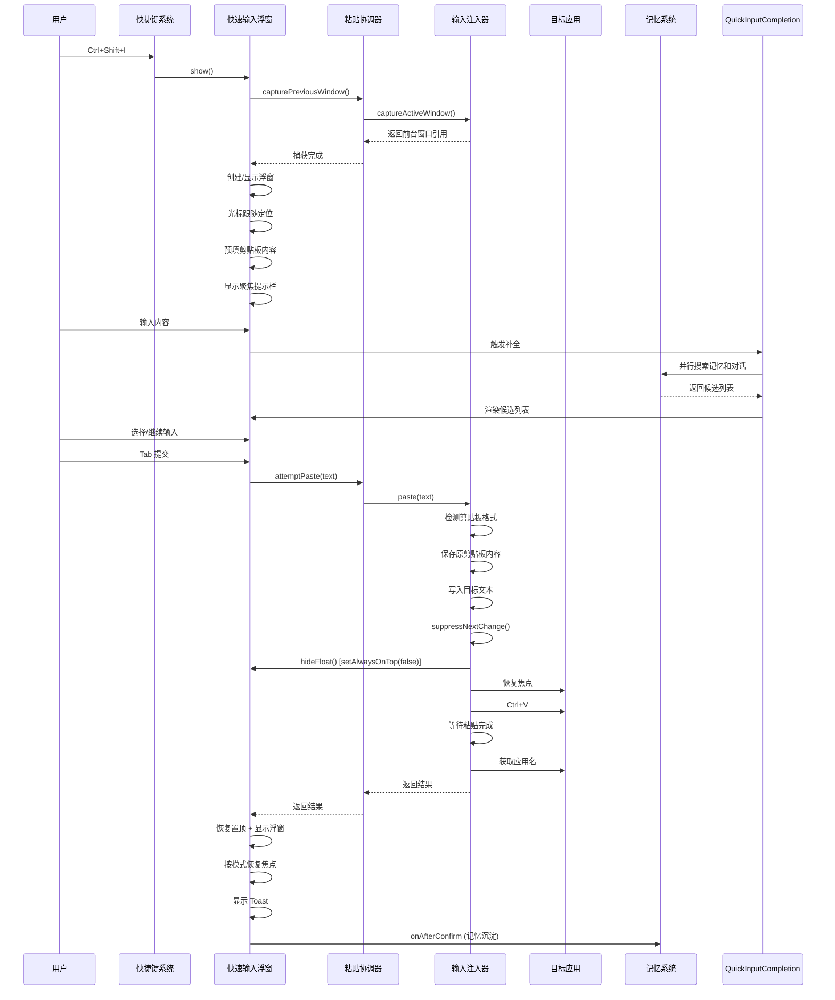
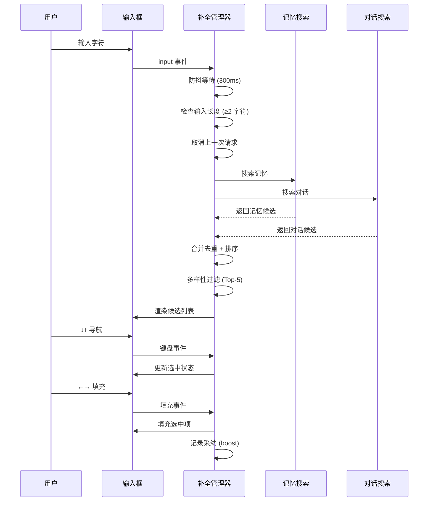

# 输入补全模块

## 1. 模块概述

输入补全模块是 Memora Sprite 的核心用户交互组件，旨在提供快速、智能的输入体验。该模块允许用户通过快捷键快速调出输入浮窗，输入内容后自动粘贴到目标应用，并提供实时补全候选功能。

### 1.1 核心价值

- **快速输入**：通过全局快捷键 `Ctrl+Shift+I` 快速调出输入浮窗
- **智能粘贴**：自动粘贴到目标应用（优先自动粘贴，失败降级到剪贴板）
- **实时补全**：基于记忆和历史对话的智能补全建议
- **记忆沉淀**：输入内容自动沉淀为记忆，供未来检索使用

### 1.2 设计原则

1. **零感知延迟**：浮窗弹出 <200ms，首次唤起经过预加载优化后延迟极低
2. **智能粘贴**：自动检测并粘贴到目标应用，失败时优雅降级
3. **流式连续输入**：默认模式下支持连续输入，浮窗保持可见
4. **安全保护**：敏感内容（密码、令牌等）自动检测并进入常驻模式
5. **自然生长**：遵循 ADR-017 分层适用原则，架构优先，枝叶按需提取

## 2. 模块组成

输入补全模块由以下几个核心组件组成：

### 2.1 快速输入浮窗（QuickInputWindow + QuickInputController）

**文件位置**：
- 主进程：`src/electron/windows/quickInputWindow.ts`
- 渲染进程：`src/electron/renderer/quick-input/quickInput.ts`

**核心职责**：
1. 创建轻量浮窗（无边框、alwaysOnTop、失焦延迟关闭）
2. 管理浮窗生命周期（单例模式，多次呼出复用同一窗口）
3. 处理用户交互（键盘事件、模式切换、确认流程）
4. 剪贴板感知预填（敏感检测 + 文本预填）

**关键特性**：
- **三键分工**：↑↓ 导航候选，←→ 填充候选项，Tab 提交内容
- **双模式支持**：
  - default 模式（pinnedMode=false）：Tab 提交后窗口不自动关闭，blur 时 200ms 延迟关闭，支持流式连续输入
  - pinned 模式（pinnedMode=true）：持久钉住浮窗，blur 不关闭，顶部显示图钉按钮可切换置顶
- **聚焦提示栏**：显示当前聚焦应用名 / 无聚焦状态，联动 Tab 启用/禁用
- **自动检测**：剪贴板内容命中敏感模式时自动启用 pinned 模式

### 2.2 补全管理器（QuickInputCompletion）

**文件位置**：
- `src/electron/renderer/quick-input/quickInputCompletion.ts`

**核心职责**：
1. 监听输入框内容变化，防抖触发补全请求
2. 并行调用 `searchMemories` + `searchSessionMessages` 两个 IPC
3. 合并去重 + 按相关度排序 + 同源多样性过滤，取 Top-5 候选
4. 渲染候选列表，支持 ↓↑ 键盘导航 + ←→ 填充回填
5. 取消上一次未完成的请求（避免乱序）
6. 采纳反馈回路：用户采纳过的候选项获得 score boost（越用越准）

**数据来源**：
- **记忆搜索**：结构化记忆（洞察/偏好/规则），双通道混合搜索，含 source
- **对话搜索**：历史对话消息原文，纯 LIKE 匹配，含 role/date
- 两者互补：记忆提供"用户是什么样的人"，对话提供"用户最近在说什么"

**L1 source 语义感知**：
- 记忆候选读取 source 字段，映射为中文标签（洞察/偏好/作品/记忆）
- 排除 persona/rule/skill/guardrail（已在 system prompt 注入，补全候选不应重复）
- 多样性过滤从"二分（记忆/对话）"升级为"多源（洞察/偏好/作品/对话）"

**score 量纲设计**：
- 记忆 score：内核返回的归一化相关度（0-1）
- 对话 score：基于关键词匹配位置（开头 0.6 → 末尾 0.4，低于记忆，对话作为兜底）
- 采纳 boost：+0.1 * min(采纳次数, 3)，最多 +0.3（通过 localStorage 跨会话持久化）

**L2 采纳反哺内核**：
- 用户采纳候选项时，通过 `boostMemory` IPC 调用内核 `writeBoost`，将行为反馈到 Memory.score
- 与渲染层 adoptedTexts 互补：adoptedTexts 提供即时 boost（当前设备），boostMemory 提供持久 boost（跨设备/跨会话）
- fire-and-forget：IPC 失败静默降级，渲染层 boost 仍生效
- 记忆候选通过 memoryId 反哺，对话候选无 memoryId 不触发（仅渲染层 boost）

**补全统计埋点**：
- 通过 `completionMetrics` 模块记录展示/采纳事件
- 记录到 localStorage，供统计面板消费（Top-1 命中率/平均位置/采纳率）
- 展示事件：候选列表渲染时记录 query + 候选项数量
- 采纳事件：用户采纳时记录 query + text + position

### 2.3 粘贴协调器（PasteCoordinator）

**文件位置**：
- `src/electron/windows/pasteCoordinator.ts`

**核心职责**：
1. 管理 InputInjector 实例（懒创建）
2. 捕获呼出浮窗前的前台窗口（show() 前调用）
3. 尝试自动粘贴（优先 paste，失败降级返回 copy）
4. 管理剪贴板三重保护抑制函数 + 自动粘贴开关

**设计原则**：
- 从 QuickInputWindow 抽离，使 QuickInputWindow 仅负责窗口管理 + IPC 路由
- PasteCoordinator 不依赖 BrowserWindow，可独立单元测试
- 集成点：QuickInputWindow.show() 调用 capturePreviousWindow()，IPC CONFIRM handler 调用 attemptPaste()

### 2.4 输入注入器（InputInjector）

**文件位置**：
- `src/electron/inputInjector.ts`

**核心职责**：
1. 记录呼出浮窗前的前台窗口（getActiveWindow）
2. 确认时恢复焦点到原窗口 + 模拟 Ctrl+V 粘贴
3. 剪贴板内容恢复（不覆盖用户原剪贴板）
4. 非文本剪贴板保护（图片/文件不破坏）
5. 任何步骤失败降级到复制+Toast 模式

**流程（9 步，2026-07-18 [问诊：自动迭代] 审查修正）**：
1. getActiveWindow（create 之前）
2. 检测剪贴板格式 + 保存原内容 + 写入目标 + suppressNextChange
3. 临时取消置顶（setAlwaysOnTop(false)，不 hide 浮窗，保持流式可见性）
4. 恢复焦点到原前台窗口
5. Ctrl+V
6. 等待粘贴完成（根据文本长度动态延迟 100-500ms）
7. 恢复原剪贴板内容 + suppressNextChange
8. 恢复置顶 + 重显浮窗 + 按模式恢复焦点（default 模式 win.focus() 支持连续输入，pinned 模式不抢焦点）
9. onAfterConfirm 记忆沉淀 + Toast 反馈

> 注：原 v0 设计包含"第 5 步 Esc（IME 处理）"用于关闭 CJK 输入法候选窗口，
> 但实际代码从未实现此步骤（审查发现注释与实现不一致）。当前流程不模拟 Esc，
> 依赖用户在呼出浮窗前手动确认 IME 候选词；若未来出现 IME 拦截 Ctrl+V 的反馈，
> 再评估是否补全 Esc 按键模拟。

### 2.5 主窗口输入框集成（InputAreaManager）

**文件位置**：
- `src/electron/renderer/panels/inputAreaManager.ts`

**核心职责**：
1. 输入框键盘事件处理（Enter 发送/停止、Esc 清空/失焦）
2. 输入框内容变化处理（自适应高度 + 发送按钮视觉反馈）
3. 发送按钮点击处理（触发发送回调）
4. 输入区 ResizeObserver（动态更新 --input-area-height CSS 变量）
5. 输入清理 + 长度限制
6. 输入补全集成（复用 QuickInputCompletion，输入时显示记忆/对话候选）

**设计原则**：
- 依赖注入：通过 InputAreaHost 接口注入 UIManager 的状态查询和回调
- 自包含 EventTracker，init() 绑定事件，cleanup() 统一清理
- 不持有流式状态，通过 host.isStreaming() 查询
- Agent 就绪/空内容守卫保留在 UIManager.emitSendMessage 内部，InputAreaManager 仅负责 UI 联动
- 补全管理器复用 quick-input 模块的 QuickInputCompletion，零重复造轮子

## 3. 关键流程

### 3.1 快速输入浮窗完整流程



### 3.2 补全管理器工作流程



## 4. 技术实现细节

### 4.1 窗口管理

**单例模式**：
- `create()` 只在首次调用时创建 BrowserWindow，后续 `show()` 复用
- 窗口属性：frame: false, alwaysOnTop: true, skipTaskbar: true, resizable: false
- 懒创建 + 预加载优化，避免首次唤起延迟

**失焦延迟关闭**：
- blur 事件后延迟 200ms 关闭，给 Alt+Tab 切换留余量
- focus 事件取消已调度的关闭
- pinned 模式下失焦不关闭

**光标跟随定位**：
- 默认在鼠标右下方偏移 16px
- 屏幕边缘溢出时自动回弹到左侧/顶部
- 确保不超出工作区边界

### 4.2 粘贴流程

**自动粘贴策略**：
- 默认模式和pinned模式都使用 `setAlwaysOnTop(false)` 临时取消置顶
- paste 完成后统一恢复置顶 + `win.show()` + 按模式 `win.focus()`
- default 模式恢复焦点支持连续输入；pinned 模式不抢焦点（保持钉住语义）

**降级处理**：
- 任何步骤失败时降级到复制+Toast 模式
- 降级路径同样不 hide 浮窗，显示 Toast 反馈
- 用户切到原窗口 Ctrl+V 时浮窗 blur 200ms 后自动关闭

### 4.3 补全算法

**数据来源**：
- 记忆搜索：`searchMemories` IPC，返回结构化记忆（洞察/偏好/作品）
- 对话搜索：`searchSessionMessages` IPC，返回历史对话消息原文

**排序算法**：
- 记忆候选：使用内核返回的归一化相关度 score (0-1)
- 对话候选：基于关键词匹配位置计算 score（开头 0.6，末尾 0.4）
- 采纳 boost：+0.1 * min(采纳次数, 3)，最多 +0.3，通过 localStorage 跨会话持久化

**多样性过滤**：
- 每个 sourceLabel 最多取 3 个候选
- 确保 Top-5 内至少 2 个来源（当多源共存时）
- 短查询（≤5 字符）场景下，对话候选获得 boost（+0.1）

### 4.4 状态管理

**pinned 模式**：
- 由渲染进程通过 `QUICK_INPUT_SET_PINNED_MODE` IPC 切换
- 状态持久化到 localStorage（`memora-quick-input-pinned`）
- 自动检测：剪贴板内容命中敏感模式时自动启用

**展开模式**：
- 状态持久化到 localStorage（`memora-quick-input-expanded`）
- 控制 textarea 的 min-height（紧凑态 36px，展开态 120px）

**提交状态**：
- `isSubmitting`：防止重复确认
- `submitGeneration`：提交批次计数器，防止过期 IPC 响应污染状态

## 5. 配置和集成

### 5.1 快捷键配置

默认快捷键：`Ctrl+Shift+I`（可在 `src/electron/shortcuts.ts` 中配置）

```typescript
// shortcuts.ts 中的配置
{
  key: 'CommandOrControl+Shift+I',
  action: () => appState.quickInputWindow.show(),
  name: '快速输入'
}
```

### 5.2 IPC 通道

输入补全模块使用的 IPC 通道：

| 通道名称 | 方向 | 描述 |
|---------|------|------|
| `QUICK_INPUT_CONFIRM` | 渲染 → 主 | 确认输入文本 |
| `QUICK_INPUT_CLOSE` | 渲染 → 主 | 关闭浮窗 |
| `QUICK_INPUT_RESIZE` | 渲染 → 主 | 调整浮窗高度 |
| `QUICK_INPUT_POLISH` | 渲染 → 主 | LLM 润色文本 |
| `QUICK_INPUT_SET_PINNED_MODE` | 渲染 → 主 | 设置常驻模式 |
| `QUICK_INPUT_SHOW` | 主 → 渲染 | 显示浮窗（携带预填内容） |
| `QUICK_INPUT_FOCUS_CHANGE` | 主 → 渲染 | 焦点变化通知 |
| `searchMemories` | 渲染 → 主 | 搜索记忆 |
| `searchSessionMessages` | 渲染 → 主 | 搜索对话 |
| `boostMemory` | 渲染 → 主 | 提升记忆分数 |

### 5.3 依赖注入

**QuickInputWindow 回调**：
```typescript
export interface QuickInputWindowCallbacks {
  onConfirm?: (text: string) => Promise<{ success: boolean }>;
  onAfterConfirm?: (text: string) => void;
  onClose?: () => void;
  onPolish?: (text: string) => Promise<{ polished: string; changed: boolean }>;
}
```

**InputAreaHost 接口**：
```typescript
export interface InputAreaHost {
  isStreaming(): boolean;
  emitSendMessage(): void;
  emitStopMessage(): void;
  switchToSettings(): void;
}
```

### 5.4 配置项

**常量配置**：
- `QUICK_INPUT_WIDTH`: 480px
- `QUICK_INPUT_HEIGHT`: 104px
- `QUICK_INPUT_MAX_HEIGHT`: 400px
- `BLUR_CLOSE_DELAY_MS`: 200ms
- `CURSOR_OFFSET_PX`: 16px
- `DEBOUNCE_MS`: 300ms
- `MIN_QUERY_LENGTH`: 2 字符
- `MAX_CANDIDATES`: 5 条
- `TOAST_DURATION_MS`: 500ms

## 6. 测试和调试

### 6.1 测试文件

输入补全模块的测试文件：

- `src/__tests__/electron/renderer/quickInput.test.ts` - 快速输入浮窗测试
- `src/__tests__/electron/renderer/quickInputCompletion.test.ts` - 补全管理器测试
- `src/__tests__/electron/windows/quickInputWindow.test.ts` - 主进程窗口管理测试
- `src/__tests__/electron/windows/pasteCoordinator.test.ts` - 粘贴协调器测试

### 6.2 测试场景

**快速输入浮窗测试**：
1. Tab 确认提交流程
2. Esc 关闭流程
3. 常驻模式切换
4. 聚焦提示栏更新
5. Toast 显示和重置
6. 高度自动调整
7. 补全列表交互

**补全管理器测试**：
1. 防抖触发和取消
2. 并行搜索和结果合并
3. 候选排序和多样性过滤
4. 键盘导航和填充
5. 采纳反馈回路
6. 边界情况处理

### 6.3 调试方法

**开发模式调试**：
```bash
# 启动开发模式
npm run dev:electron

# 打开开发者工具
# 快捷键 Ctrl+Shift+I 触发浮窗
# 在开发者工具中查看控制台日志
```

**日志级别**：
- 主进程日志：使用 `logger` 模块
- 渲染进程日志：使用 `reportError` 和 `console.log`

**常见问题排查**：
1. **浮窗不显示**：检查快捷键注册、窗口创建、IPC 通道
2. **补全不触发**：检查输入长度、防抖时间、IPC 调用
3. **粘贴失败**：检查 nut-js 可用性、剪贴板格式、目标应用焦点
4. **状态不同步**：检查 IPC 通道、localStorage 持久化、竞态防护

## 7. 性能优化

### 7.1 预加载策略

**InputInjector 预加载**：
- 在应用启动阶段调用 `preloadInputInjector()` fire-and-forget
- 提前触发 nut-js 动态 import，避免首次唤起延迟
- 首次 show() 延迟从 ~50-200ms 降至 ~50-100ms

**补全管理器优化**：
- 防抖 300ms，避免高频 IPC
- 最小 2 字符触发，避免空查询
- 取消上一次未完成的请求，避免乱序

### 7.2 内存管理

**资源清理**：
- EventTracker 统一管理监听器，cleanup() 时清理
- 补全管理器销毁时取消所有待处理请求
- 窗口关闭时清理所有状态和定时器

**状态持久化**：
- 仅持久化必要状态（pinned 模式、展开模式、采纳记录）
- localStorage 遵循 `memora-` 前缀约定
- 采纳记录 LRU 淘汰上限 100 条

## 8. 未来扩展

### 8.1 已识别的 v2 升级路径

根据用户体验闭环路线图，输入补全模块的 v2 升级路径包括：

1. **ActiveWindow 无 appName 字段**：窗口标题 split 启发式 → inputInjector 升级补 getProcessName
2. **macOS 窗口标题格式不同**：v1 仅 Windows 验证 → v2 跨平台验证
3. **OS 级焦点监听缺失**：当前依赖 Electron focus 事件 → v2 接入 OS 级焦点监听

### 8.2 待触发的优化项

1. **剪贴板写入失败无显式 Toast 反馈**：用户反馈"复制没反应"时再评估
2. **提交期间 Esc 键不触发 keydown**：用户反馈"想取消粘贴"时再评估
3. **show() 并发触发无显式锁**：当前三重机制已覆盖，引入显式锁属过度设计

## 9. 相关文档

- [用户体验闭环路线图](./用户体验闭环路线图.md) - 闭环 7：快速输入→记忆沉淀
- [场景闭环设计](./场景闭环设计.md) - 快速输入浮窗场景设计
- [ADR-017 自然生长原则](../.trae/rules/decisions/ADR-017-natural-growth-redefinition.md) - 分层适用原则
- [项目规则](../.trae/rules/project-rules.md) - 项目总则和技术栈

## 10. 维护指南

### 10.1 代码规范

- 遵循 ADR-017 自然生长原则：架构先行，枝叶层 2 次提取
- 命名规范：文件夹连字符，TS 文件小驼峰，类大驼峰，变量小驼峰
- 注释规范：函数级、类级、文件级、变量级注释
- 错误处理：统一 MemoraError 体系，空 catch 块禁止

### 10.2 测试要求

- 核心模块保持 1:1 测试覆盖率
- 提交前通过 pre-commit lint + typecheck + commitlint
- 补测试先读现有测试文件再生成
- 补测试后运行项目测试命令

### 10.3 变更流程

1. 功能开发先进行方案设计，不能直接编写代码
2. 底层问题优先修复（架构/基础设施层面）
3. 代码修复独立可回滚（每次修复独立提交）
4. 更新任务清单：`tasks/待完成任务.md` 和 `tasks/已完成任务.md`

---

*文档版本：v1.0*  
*最后更新：2026-07-18*  
*适用项目：Memora Sprite*