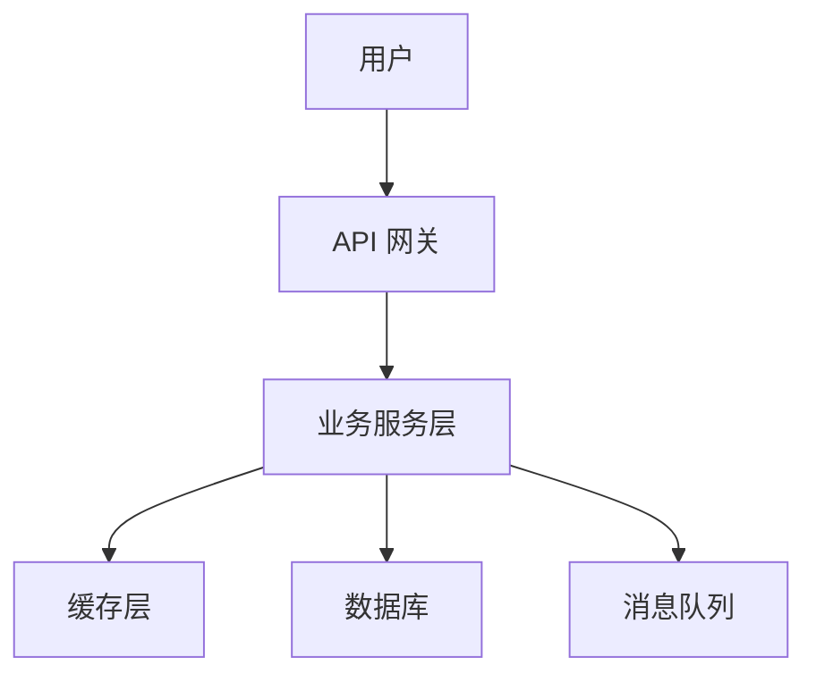

## 技能：系统架构设计

这个技能用于将 PRD 中的功能需求，转化为可落地的技术设计方案。

### 工作流程

1.  **技术选型**：
    *   **分析需求**：根据 PRD 中的非功能性需求（并发量、数据量、延迟、可用性等），分析技术选型的约束条件。
    *   **调研与对比**：利用联网搜索，调研并对比主流技术栈的优劣（如前端框架、后端语言、数据库、缓存、消息队列等）。
    *   **给出建议**：给出技术选型的建议方案，并说明选择的理由和潜在风险。
2.  **系统总体架构**：
    *   **架构风格**：确定系统的整体架构风格（如单体、微服务、事件驱动、Serverless 等）。
    *   **模块划分**：将系统分解为高内聚、低耦合的核心模块（服务），并定义模块间的职责和边界。
    *   **架构图**：使用文本描述或 Mermaid 语法绘制系统的总体架构图，展示模块、数据流和外部依赖。
3.  **关键模块详细设计**：
    *   对核心模块进行详细设计，包括：
        *   **数据模型设计**：设计核心实体、数据结构和关系（ER 图）。
        *   **API 设计**：定义模块对外暴露的接口契约。
        *   **核心算法与逻辑**：描述关键业务逻辑和算法的实现思路。
4.  **生成架构设计文档**：将以上内容整理成 `[项目名]-架构设计-v1.md`。

### 执行要点

*   **权衡取舍**：架构设计是权衡的艺术。在方案对比时，必须清晰地列出每个方案的优缺点和适用场景。
*   **遵循原则**：遵循通用的架构设计原则，如单一职责、依赖倒置、接口隔离、关注点分离等。
*   **关注非功能**：架构设计不仅是功能实现，更要关注性能、扩展性、可维护性、安全性等非功能属性。

### 输出模板

生成架构设计文档时，请遵循以下标准结构：

```markdown
# {{项目名}} 系统架构设计文档

> **版本**：v1.0  
> **作者**：{{作者}}  
> **创建日期**：{{日期}}  
> **关联 PRD**：[链接到 PRD 文档]

---

## 1. 架构概述

### 1.1 设计目标
<!-- 描述架构设计的核心目标：如支持百万级并发、99.99% 可用性等 -->

### 1.2 架构风格
<!-- 说明采用的架构风格：单体/微服务/事件驱动/Serverless 等，以及选择理由 -->

### 1.3 设计原则
- 单一职责：每个模块只做一件事
- 依赖倒置：高层模块不依赖低层模块，依赖抽象
- ...

---

## 2. 技术选型

### 2.1 技术栈总览
| 层次 | 技术 | 版本 | 选型理由 |
|------|------|------|----------|
| 前端 | {{框架名}} | {{版本}} | {{理由}} |
| 后端 | {{语言}} | {{版本}} | {{理由}} |
| 数据库 | {{DB名}} | {{版本}} | {{理由}} |

### 2.2 候选方案对比
<!-- 对核心技术选型进行 2-3 个方案的详细对比 -->

| 维度 | 方案 A ({{技术}}) | 方案 B ({{技术}}) |
|------|-------------------|-------------------|
| 性能 | | |
| 社区生态 | | |
| 学习曲线 | | |
| 运维复杂度 | | |
| **推荐** | ⭐ | |

---

## 3. 系统架构图

### 3.1 总体架构
<!-- 使用 Mermaid 或文本描述系统总体架构 -->



### 3.2 模块依赖关系
<!-- 描述各模块之间的调用关系和数据流向 -->

---

## 4. 模块详细设计

### 4.1 模块划分
| 模块 | 职责 | 对外接口 | 依赖 |
|------|------|----------|------|
| {{模块名}} | {{职责描述}} | {{接口列表}} | {{依赖的模块}} |

### 4.2 核心模块设计

#### {{模块名 A}}
**职责**：描述模块的核心职责

**数据模型**：
```typescript
interface EntityA {
  id: string;
  // ...
}
```

**接口定义**：
```typescript
interface ServiceA {
  methodA(params: ParamsA): ResultA;
}
```

**核心流程**：
<!-- 描述关键业务逻辑的处理流程 -->

---

## 5. 数据架构

### 5.1 数据模型 (ER 图)
<!-- 使用 Mermaid 或文本描述核心实体关系 -->

### 5.2 数据库设计
| 表名 | 字段 | 类型 | 索引 | 说明 |
|------|------|------|------|------|
| {{表名}} | {{字段名}} | {{类型}} | {{索引}} | {{说明}} |

---

## 6. 部署架构

### 6.1 部署拓扑
<!-- 描述系统部署结构：容器化/物理机、集群规模、网络拓扑 -->

### 6.2 环境规划
| 环境 | 用途 | 配置 |
|------|------|------|
| 开发环境 | 日常开发 | 小规模集群 |
| 测试环境 | 集成测试 | 与生产一致 |
| 生产环境 | 正式服务 | 高可用集群 |

---

## 7. 安全设计
<!-- 描述认证授权、数据加密、审计日志等安全策略 -->

---

## 8. 性能与扩展
<!-- 描述性能指标、扩容策略、性能测试方案 -->

---

## 附录
<!-- 术语表、参考资料、相关文档链接 -->
```