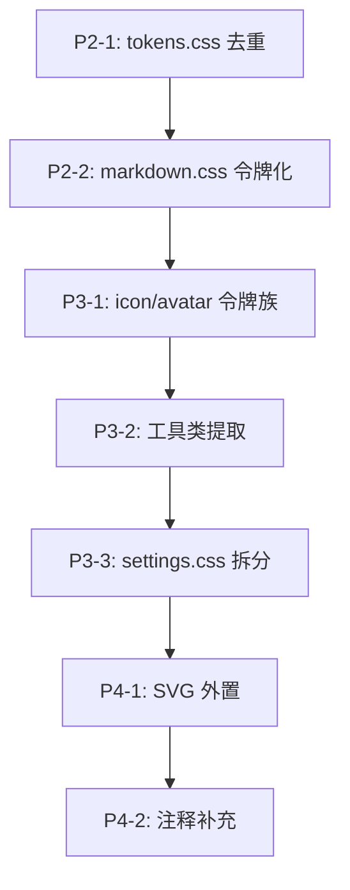

# Step 8 — Sprite 样式层审查

> **审查日期**：2026-07-19
> **审查范围**：sprite 样式层（~10,300 行，32 CSS 文件 + 3 HTML 入口）
> **审查方式**：凭工程经验独立审查，不依赖项目规则
> **前序步骤**：Step 1-7（已完成）

---

## 一、审查范围与数据概览

### 1.1 文件清单

| 层级 | 文件 | 行数 | 角色 |
|------|------|------|------|
| **foundation** | tokens.css | 389 | 设计令牌（双主题 CSS 变量） |
| | base.css | 306 | 全局重置 + 原子样式 + 无障碍 |
| | utilities.css | 113 | 工具类（flex 布局 / 文本截断） |
| **layout** | layout.css | 965 | 页面布局 + 侧边栏 + 面板区 + 响应式 |
| **chat** | chat.css | 11 | 聚合器（@import 7 子模块） |
| | chat-toolbar.css | 240 | 对话工具栏 + 精灵状态条 |
| | chat-perception.css | 101 | 感知面板浮层 |
| | chat-datenav.css | 273 | 日期导航 + 会话列表 |
| | chat-messages-banner.css | 295 | 主动性/里程碑/建议横幅 |
| | chat-messages-bubble.css | 418 | 消息气泡 + 头像 + 记忆召回 |
| | chat-messages-input.css | 628 | 输入区 + 补全 + 发送/停止 + 空状态 |
| | chat-messages-misc.css | 638 | 思考过程 + 工具卡片 + 动画 + 启动 |
| **memory** | memory.css | 16 | 聚合器（@import 7 子模块 + 1 分析面板） |
| | memory-list.css | 242 | 记忆列表 |
| | memory-detail.css | 92 | 记忆详情 |
| | memory-views.css | 296 | 视图切换 + 时间线 + 回收站 |
| | memory-graph-core.css | 292 | 图谱核心 + 更多菜单 + 图例 + tooltip |
| | memory-graph-search.css | 183 | 高级搜索 + 搜索高亮 + 洞察栏 |
| | memory-graph-detail.css | 286 | 关联记忆 + 演化脉络 + 健康度 |
| | memory-graph-misc.css | 573 | 增强 1-5 + 时间线 + 回收站 |
| | completion-stats.css | 148 | 补全统计面板 |
| **panels** | dashboard.css | 407 | 仪表盘 |
| | perception.css | 378 | 感知面板 |
| | clipboard.css | 199 | 剪贴板面板 |
| | settings.css | 917 | 设置面板（最大单体） |
| **overlays** | modal.css | 556 | 模态弹窗 + 引导 |
| | toast.css | 115 | Toast 通知 |
| | command-palette.css | 142 | 命令面板 |
| | search-messages.css | 172 | 对话搜索浮层 |
| **content** | markdown.css | 257 | Markdown 渲染样式 |
| **windows** | float.css | 287 | 浮动窗口 |
| | quick-input.css | 373 | 快速输入窗口 |
| **HTML** | index.html | 1760 | 主窗口入口 |
| | float.html | ~80 | 浮动窗口入口 |
| | quick-input.html | ~130 | 快速输入窗口入口 |
| **合计** | | **~10,300** | |

### 1.2 关键指标速览

| 指标 | 数值 | 评价 |
|------|------|------|
| CSS 文件数 | 32 | 合理，每个文件有明确功能边界 |
| `!important` 出现次数 | 5 | 优秀——全部在 base.css，用于 `.hidden` 和 `prefers-reduced-motion` |
| ID 选择器出现次数 | 249 | 偏高但可接受——均为页面唯一元素，配合 class 使用 |
| `@media` 查询 | 7 | 偏少但 Desktop App 合理 |
| 内联 `style=` 属性 | 0 | 优秀——CSP 策略 + 工程纪律到位 |
| 内联 `<style>` 块 | 0 | 优秀 |
| 裸 `px` 值出现次数 | 812 | 偏高——其中 ~60% 可令牌化（见 §2.3） |
| 深浅主题令牌重复率 | ~50% | 需要优化——半径/字号/间距/过渡/z-index 在两主题中完全重复 |

---

## 二、10 项审查维度详细分析

### 2.1 令牌系统：tokens.css 是否真的是单一真理源

**结论：是，但存在冗余维护负担。**

**亮点**：

- `:root` 定义浅色主题，`[data-theme="dark"]` 定义深色主题，选择器结构正确
- 主进程通过 `webContents.executeJavaScript()` 在页面加载前注入 `data-theme` 属性，避免 FOUC 闪烁——设计精良
- 设置面板提供浅色/深色/跟随系统三选一，用户体验完整
- 三窗口（index.html / float.html / quick-input.html）统一引用 tokens.css，消除令牌漂移
- 注释详细，语义清晰

**问题**：

| 问题 | 严重度 | 详情 |
|------|--------|------|
| 深色主题重复定义无关令牌 | **P2** | `--radius-*`（6 个）、`--transition-*`（4 个）、`--font-*`（12 个）、`--space-*` 全部引用、`--z-*`、`--pad-card`、`--input-padding-md` 等 ~50 个令牌在浅色和深色主题中值完全相同，但仍被重复定义。这导致修改一个非颜色令牌时必须改两处，容易遗漏 |
| 缺少 `--space-*` 在深色主题中的定义 | 信息 | 深色主题间接复用浅色主题的 `--space-*` 令牌（通过 `--pad-card: var(--space-3) var(--space-4)` 等语义别名），但 `--space-*` 本身没有在 `[data-theme="dark"]` 中重新定义——这意味着它们依赖 `:root` 的层叠。目前是正确的，但如果未来有人误在 `[data-theme="dark"]` 中覆盖 `--space-*` 则可能造成不一致 |

**建议**：

将 tokens.css 拆分为"主题无关令牌"和"主题相关令牌"两层：

```css
/* 主题无关令牌（:root 定义一次，深色主题自动继承） */
:root {
  --radius-*: ...;
  --transition-*: ...;
  --font-*: ...;
  --space-*: ...;
  --z-*: ...;
  --pad-card: ...;
  --input-padding-md: ...;
  --btn-height-*: ...;
  --gap-compact: ...;
  --padding-sm: ...;
  --padding-base: ...;
  --font-weight-*: ...;
  --input-area-height: ...;
  --float-window-size: ...;
  --float-sphere-size: ...;
  --float-sphere-logo: ...;
}

/* 浅色主题颜色 */
:root {
  --bg: ...;
  --text: ...;
  /* 所有颜色令牌 */
}

/* 深色主题颜色（仅覆盖颜色，其余继承 :root） */
[data-theme="dark"] {
  --bg: ...;
  --text: ...;
  /* 仅颜色令牌 */
}
```

这样可减少约 150 行重复代码，同时消除"改个半径要改两处"的维护陷阱。

### 2.2 令牌命名规范

**结论：一致，设计良好。**

| 命名空间 | 示例 | 评价 |
|----------|------|------|
| `--space-*` | `--space-1`(4px) → `--space-8`(32px)，含半级 `--space-1-5` / `--space-2-5` | 阶梯合理，覆盖 4px–32px |
| `--radius-*` | `--radius-xs`(3px) → `--radius-window`(18px) + `--radius-pill`(100px) | 命名清晰，覆盖全场景 |
| `--font-*` | `--font-3xs`(9px) → `--font-2xl`(28px) + `--font-h1` / `--font-score` / `--font-mono` | 层级完整，语义明确 |
| `--shadow-*` | `--shadow-sm` / `--shadow-float` / `--shadow-accent` / `--shadow-accent-lg` / `--shadow-window` | 语义化命名好 |
| `--transition-*` | `--transition-fast`(0.12s) / `--transition-base`(0.2s) / `--transition-slow`(0.3s) / `--transition-xl`(0.5s) | 粒度合理 |
| `--z-*` | `--z-base`(1) → `--z-toast`(2000)，含 10 级 | 层级清晰，避免 z-index 战争 |
| 语义别名 | `--pad-card` / `--input-padding-md` / `--gap-compact` / `--padding-sm` / `--padding-base` | 良好实践——减少重复书写 `var(--space-x) var(--space-y)` |

**无命名规范问题**。

### 2.3 裸 px 值分析

**结论：812 处裸 px 值，其中约 60% 可令牌化，但优先级不高。**

分布统计：

| 文件 | 裸 px 数 | 典型场景 |
|------|----------|----------|
| chat-messages-misc.css | 62 | 动画关键帧、思考过程微调 |
| chat-messages-input.css | 60 | 输入框尺寸、按钮图标 |
| memory-graph-misc.css | 54 | 图谱节点、增强微交互 |
| chat-datenav.css | 36 | 日期导航列表 |
| chat-messages-bubble.css | 33 | 头像尺寸、消息气泡微调 |
| memory-graph-detail.css | 26 | 关联记忆列表 |
| settings.css | 58 | 表单元素（最大单体） |
| layout.css | 80 | 侧边栏布局 |
| 其余文件 | ~403 | 分散 |

**分类**：

| 类别 | 占比 | 令牌化建议 |
|------|------|-----------|
| 1px 边框/分隔线 | ~25% | 不需要——`--border-width` 过度设计 |
| 动画关键帧（translateX/translateY） | ~15% | 不需要——动画参数不应令牌化 |
| 小尺寸（图标 12px/14px/16px，头像 28px，按钮 32px） | ~30% | **可令牌化**：`--icon-sm` / `--icon-md` / `--icon-lg` / `--avatar-sm` / `--btn-circle-sm` |
| 微调间距（2px/4px 补偿） | ~15% | 部分可令牌化但收益低 |
| 其他（窗口尺寸、特殊布局） | ~15% | 不适合令牌化 |

**建议**：新增 `--icon-*` 和 `--avatar-*` 令牌族，可将 ~240 处裸 px 替换为令牌。优先级 P3——不影响功能，但提升一致性。

### 2.4 文件切分合理性

**结论：整体合理，不需要合并或拆分。**

| 文件 | 行数 | 评价 |
|------|------|------|
| chat.css | 11 | 纯聚合器——正确模式 |
| memory.css | 16 | 纯聚合器——正确模式 |
| chat-perception.css | 101 | 小但功能独立，无需合并 |
| memory-detail.css | 92 | 小但功能独立，无需合并 |
| toast.css | 115 | 小但独立组件，自包含 |
| completion-stats.css | 148 | 适度大小，功能独立 |
| command-palette.css | 142 | 适度大小，功能独立 |
| search-messages.css | 172 | 适度大小，功能独立 |
| chat-messages-input.css | 628 | 最大单体之一，但功能内聚（输入区 + 补全 + 发送/停止 + 空状态），可接受 |
| chat-messages-misc.css | 638 | 最大单体之一，但功能内聚（思考 + 工具卡片 + 动画 + 启动），可接受 |
| settings.css | 917 | 最大单体——建议未来按 tab 拆分为 settings-llm.css / settings-sprite.css / settings-project.css 等，但不紧急 |

**聚合器模式**（chat.css / memory.css）值得肯定：
- 原始单体 CSS 按功能域拆分后，通过 `@import` 聚合器保持向后兼容
- HTML 只需引用一个聚合器，子模块变更不影响 HTML
- 子模块内的层叠顺序与原单体一致

### 2.5 选择器特异性

**结论：健康，无滥用。**

| 指标 | 数值 | 评价 |
|------|------|------|
| `!important` | 5 | 仅 `.hidden { display: none !important }`（1 处）和 `prefers-reduced-motion` 覆盖（3 处），注释中提及 1 处——全部合理 |
| ID 选择器 | 249 | 数量偏高，但所有 ID 选择器都配合 class 使用（如 `#input-area` + `.chat-completion-list`），未出现裸 ID 选择器 |
| 嵌套深度 | ≤3 层 | 良好——最深的典型路径是 `.chat-completion-list .completion-item.selected:hover` |
| 伪元素/伪类 | 正常使用 | `::before` / `::after`（分隔线装饰）、`:hover` / `:focus-visible` / `:focus-within` / `:nth-child` |

**无需要修复的特异性问题**。

### 2.6 重复样式

**结论：少量重复，主要通过工具类已解决。**

**已提取的工具类**（utilities.css）：

| 类名 | 用途 |
|------|------|
| `.flex-center` | flex + 居中 |
| `.flex-between` | flex + space-between |
| `.flex-shrink-0` | 防止收缩 |
| `.text-truncate` | 文本溢出省略 |

**发现的重复模式**：

| 模式 | 出现次数 | 建议 |
|------|----------|------|
| `display: flex; align-items: center; gap: var(--space-1-5)` | ~15 处 | 可提取 `.flex-row-gap` 工具类（P3） |
| 圆形按钮 `width: 32px; height: 32px; border-radius: 50%` | ~8 处 | 可提取 `.btn-circle` 工具类（P3） |
| `font-size: var(--font-xs); color: var(--text-3)` | ~12 处 | 可提取 `.text-meta` 工具类（P3） |

**建议**：以上 3 个工具类净收益约 60 行，优先级 P3。当前不提取也不影响可维护性。

### 2.7 CSS 架构层级

**结论：清晰，遵循 foundation → layout → modules 的经典分层。**

```
foundation/          ← 基础层（令牌 + 重置 + 工具类）
  ├── tokens.css     ← 设计令牌（CSS 变量）
  ├── base.css       ← 全局重置 + 原子样式
  └── utilities.css  ← 布局工具类

layout/              ← 布局层
  └── layout.css     ← 页面骨架（侧边栏 + 面板区 + 响应式）

chat/                ← 功能模块层
  ├── chat.css       ← 聚合器
  └── 7 子模块

memory/              ← 功能模块层
  ├── memory.css     ← 聚合器
  └── 8 子模块

panels/              ← 功能模块层（4 面板）
overlays/            ← 功能模块层（4 浮层）
content/             ← 功能模块层（Markdown 渲染）
windows/             ← 功能模块层（2 独立窗口）
```

**HTML 加载顺序**：`tokens.css → base.css → utilities.css → layout.css → chat.css → memory.css → panels/* → overlays/* → content/*`

此顺序正确：
- 令牌最先加载（后续所有层依赖）
- 基础样式其次
- 布局第三
- 功能模块最后（按依赖关系：chat 和 memory 先于 panels/overlays）

**架构评分：9/10**。唯一扣分点：settings.css（917 行）作为 panels 层的一员，体积是其他 panel 的 2-5 倍，建议未来按 tab 拆分。

### 2.8 响应式

**结论：Desktop App 定位下合理，但可小幅增强。**

| 文件 | 断点 | 用途 |
|------|------|------|
| layout.css | 799px | 侧边栏从固定宽度切换为 flex 比例 |
| layout.css | 639px | 侧边栏完全折叠 |
| layout.css | 1024px | 恢复宽屏布局 |
| dashboard.css | 799px | 压缩仪表盘列 |
| completion-stats.css | 600px | 统计面板栈式布局 |
| base.css | prefers-reduced-motion | 关闭动画 |
| float.css | prefers-reduced-motion | 关闭浮动窗口动画 |

**评价**：作为一个 Electron Desktop App，响应式断点覆盖了：窗口缩小（799px/639px）、宽屏恢复（1024px）、极窄（600px）。没有移动端适配需求，当前覆盖合理。加分项：`prefers-reduced-motion` 无障碍支持。

**建议**：无需额外断点。

### 2.9 主题切换

**结论：架构正确，但令牌冗余需优化。**

**架构**：

```
主进程（main.ts）
  └── webContents.executeJavaScript()
        └── 读取 localStorage.getItem('theme-mode')
              └── document.documentElement.setAttribute('data-theme', ...)
                    └── CSS 变量切换（:root ↔ [data-theme="dark"]）
```

**主题切换路径**：

1. 设置面板 → 单选按钮（浅色/深色/跟随系统）
2. 主进程 IPC 通信 → 写入 localStorage + 动态设置 `data-theme`
3. 跟随系统模式：监听 `nativeTheme.on('updated')`

**评价**：
- 架构正确：主进程注入避免 FOUC
- "跟随系统"模式完整：监听 `nativeTheme.updated` 事件
- 三个 HTML 入口文件统一引用 tokens.css
- 深色主题使用 Catppuccin Mocha 色板，审美一致

**问题**：见 §2.1——约 50% 令牌在深浅主题中重复定义且值相同。

### 2.10 HTML 结构与性能

**结论：结构良好，无性能问题。**

**HTML 结构**（index.html 1760 行）：

| 区域 | 行数范围 | 内容 |
|------|----------|------|
| `<head>` | 1-37 | Meta + CSP + 18 个 `<link>` 样式表 |
| SVG 精灵 | 39-248 | 约 50 个 SVG symbol（图标集） |
| 标题栏 | ~250-256 | 窗口控制按钮 |
| 核心窗口 | 258-1718 | 6 个面板 + 3 个弹窗 + onboarding |
| 快捷键弹窗 | 1722-1766 | 快捷键帮助表格 |
| Toast | 1768-1770 | Toast 通知区域 |

**HTML 质量**：

| 检查项 | 结果 |
|--------|------|
| 内联 `<style>` | 0——优秀 |
| 内联 `style=` 属性 | 0——CSP 策略保障 |
| 内联 `<script>` | 0——所有 JS 由 TS 编译 |
| 语义化 HTML | 良好——使用了 `<header>` / `<main>` / `<nav>` / `<section>` / `<kbd>` 等 |
| ARIA 属性 | 充分——`aria-label` / `aria-hidden` / `aria-expanded` / `role` 等完整 |
| 注释 | 充分——每个大区块有注释说明 |

**性能评估**：

| 检查项 | 结果 |
|--------|------|
| 选择器复杂度 | 低——无深层嵌套，无通配符，无属性选择器（除 `[data-theme]`） |
| 重排风险 | 低——动画使用 `transform` + `opacity`（GPU 合成），`contain: layout style paint` 用于消息气泡 |
| 过渡性能 | 良好——`transition` 时长 0.12s–0.3s，仅作用于颜色/背景/阴影/透明度 |
| CSS 加载 | 18 个 `<link>` 标签，串行加载——但 Electron 本地文件，可忽略网络延迟 |

**建议**：SVG 精灵（~210 行）可考虑外置为独立 `.svg` 文件（P4），但当前内联方案在 CSP 策略下是安全的，且避免了额外的 HTTP 请求。

---

## 三、模块评分

| 层级 | 文件 | 令牌使用 | 命名规范 | 代码质量 | 注释 | 综合 |
|------|------|----------|----------|----------|------|------|
| foundation | tokens.css | 9/10 | 10/10 | 9/10 | 10/10 | **9.5** |
| foundation | base.css | 9/10 | 9/10 | 10/10 | 9/10 | **9.3** |
| foundation | utilities.css | 10/10 | 9/10 | 10/10 | 9/10 | **9.5** |
| layout | layout.css | 8/10 | 9/10 | 9/10 | 9/10 | **8.8** |
| chat | 8 文件 | 8/10 | 9/10 | 9/10 | 9/10 | **8.8** |
| memory | 9 文件 | 8/10 | 9/10 | 9/10 | 9/10 | **8.8** |
| panels | 4 文件 | 8/10 | 9/10 | 9/10 | 9/10 | **8.8** |
| overlays | 4 文件 | 9/10 | 9/10 | 10/10 | 9/10 | **9.3** |
| content | markdown.css | 7/10 | 9/10 | 9/10 | 9/10 | **8.5** |
| windows | 2 文件 | 9/10 | 9/10 | 9/10 | 9/10 | **9.0** |
| **总体** | | **8.5/10** | **9.2/10** | **9.3/10** | **9.2/10** | **9.0** |

---

## 四、问题分级

### P1（必须修复 / 阻止发布）

**无**。

### P2（建议修复 / 发布前优先）

| 编号 | 问题 | 位置 | 预估工作量 |
|------|------|------|-----------|
| P2-1 | 深浅主题令牌重复定义约 50 个无关令牌（半径/字号/间距/过渡/z-index），修改需改两处 | tokens.css:282-463 | 30 分钟 |
| P2-2 | markdown.css 裸 px 值比例最高（17/257 = 6.6%），且 Markdown 渲染区域是用户高频阅读区 | content/markdown.css | 20 分钟 |

### P3（建议修复 / 发布后可修）

| 编号 | 问题 | 位置 | 预估工作量 |
|------|------|------|-----------|
| P3-1 | 新增 `--icon-sm` / `--icon-md` / `--icon-lg` / `--avatar-sm` 令牌族，替换 ~240 处裸 px | 跨 20+ 文件 | 60 分钟 |
| P3-2 | 提取 `.flex-row-gap` / `.btn-circle` / `.text-meta` 工具类，消除 ~35 处重复模式 | utilities.css + 跨文件 | 30 分钟 |
| P3-3 | settings.css 917 行单体，建议按 tab 拆分（llm/sprite/project/profile/audit） | panels/settings.css | 40 分钟 |

### P4（可选 / 长期优化）

| 编号 | 问题 | 位置 | 预估工作量 |
|------|------|------|-----------|
| P4-1 | SVG 精灵外置为独立 `.svg` 文件，减少 HTML 行数 ~210 行 | index.html | 20 分钟 |
| P4-2 | 部分文件注释偏少（memory-detail.css 92 行仅 1 行注释；completion-stats.css 148 行无区块注释） | memory/ | 15 分钟 |

---

## 五、设计评价

### 亮点

1. **聚合器模式**：chat.css 和 memory.css 作为纯 `@import` 聚合器，原始单体 CSS 按功能域拆分后保持向后兼容，是教科书级的 CSS 重构模式
2. **CSP 策略 + 零内联样式**：`style-src 'self'` 策略 + 主进程注入主题，在安全性和功能完整性之间取得了精妙平衡
3. **z-index 令牌体系**：10 级 z-index 命名令牌（`--z-base` 到 `--z-toast`），彻底消除了 z-index 数字战争
4. **主题切换架构**：主进程 `executeJavaScript` 注入 → 避免 FOUC → 设置面板三选一 → 跟随系统，完整闭环
5. **无障碍覆盖**：`prefers-reduced-motion` 两处适配 + `:focus-visible` 聚焦轮廓 + ARIA 属性完整
6. **语义别名令牌**：`--pad-card` / `--input-padding-md` 等语义别名，减少重复书写 `var(--space-x) var(--space-y)`
7. **`contain` 属性优化**：消息气泡使用 `contain: layout style paint` 隔离重排重绘，流式渲染时性能优秀
8. **注释质量**：每个文件有文件级注释，大部分区块有区块注释，易读性高

### 可改进

1. **令牌分层**：主题无关令牌不应在深浅主题中重复定义（见 P2-1）
2. **裸 px 令牌化**：图标尺寸、头像尺寸等高频重复值可提取为令牌（见 P3-1）
3. **settings.css 单体**：917 行单体 CSS 可按 tab 拆分（见 P3-3）

---

## 六、修复建议优先级排序



**推荐执行批次**：

| 批次 | 内容 | 净收益 | 风险 |
|------|------|--------|------|
| 第一批 | P2-1（tokens.css 去重） | 减少 ~150 行重复，消除维护陷阱 | 低——纯 CSS 变量重构 |
| 第二批 | P2-2 + P3-1（markdown + icon 令牌化） | 提升 Markdown 渲染区一致性 | 低——新增令牌 + 替换引用 |
| 第三批 | P3-2 + P3-3（工具类 + settings 拆分） | 减少重复，提升可维护性 | 中——settings.css 拆分涉及 HTML 引用变更 |

---

## 七、与前序步骤的关系

- **Step 3（渲染层面板/组件）**：样式层审查可作为 Step 3 的补充——Step 3 关注 TS 组件逻辑，本步骤关注 CSS 样式质量
- **Step 9（跨模块整合审查）**：样式层发现的问题（如 tokens.css 冗余）可作为 Step 9 的"共享层完整性"审查输入

---

## 八、总结

Sprite 样式层整体质量高，架构清晰，工程纪律严格（CSP 零内联、聚合器模式、z-index 令牌体系）。主要改进空间集中在令牌冗余优化（P2-1）和裸 px 令牌化（P3-1），均为低风险高收益的 CSS 变量重构。无 P1 阻塞项。

**综合评分：9.0/10**

---

> **下一步**：进入 Step 9（跨模块整合审查，最终步）——审查 IPC 通道治理、共享层完整性、Web/Electron 一致性。